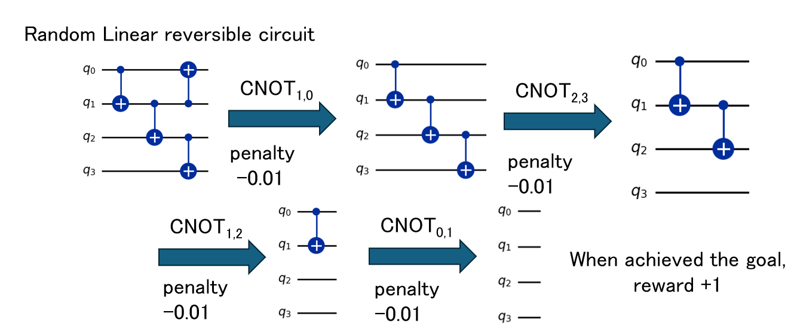

# utokyo-qiskit-fall-fest-2025-qurl

UTokyo Qiskit Fall Fest 2025 (Team: QuRL)

# Quantum Circuit Optimization Using Reinforcement Learning

## Project Overview

This project focuses on optimizing quantum circuits using reinforcement learning techniques. Our approach specifically deals with quantum circuits composed solely of CNOT gates. The optimization process involves the following key aspects:

- **Optimization Strategy**: We employ reinforcement learning to optimize quantum circuits, aiming to find the most efficient circuit configuration.

- **Circuit Composition**: We focus on quantum circuits that exclusively use CNOT gates, simplifying the optimization problem while maintaining practical relevance.

- **Optimization Goal**: The objective is to cancel out CNOT gates from the original circuit. The optimization is considered complete when all CNOT gates are successfully eliminated.

- **Reward Structure**: Our reinforcement learning model uses the designed system below:
  - Small penalties are applied for each CNOT gate placement to encourage minimal gate usage
  - A substantial reward is granted upon reaching the goal state (complete elimination of CNOT gates)

## Team Members

| Member | Role |
|--------|------|
| @king-p3nguin | Team Member |
| @Ojun52 | Team Member |
| @Naoki0824 | Team Member |
| @SoshunNaito | Mentor |
| @qphkk | Mentor |

## 

## References

- K. N. Patel, I. Markov, and J. Hayes, "Optimal synthesis of linear reversible circuits," Quantum Inf. Comput. 8, 282 (2008).

- D. Kremer, V. Villar, H. Paik, I. Duran, I. Faro, and J. Cruz-Benito, "Practical and Efficient Quantum Circuit Synthesis and Transpiling with Reinforcement Learning," [arXiv:2405.13196](http://arxiv.org/abs/2405.13196).

- https://github.com/king-p3nguin/rlss2025-ai-linear-function-synthesis
